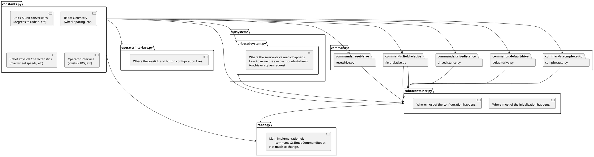

# Robotpy
## Command Based

```plantuml
@startuml
package "constants.py" as constants {
  [Units & unit conversions\n(degrees to radian, etc)]
  [Robot Geometry\n(wheel spacing, etc)]
  [Robot Physical Characteristics\n(max wheel speeds, etc)]
  [Operator Interface\n(joystick ID's, etc) ]
}

package "robot.py" as robot {
  [Main implementation of:\n\tcommands2.TimedCommandRobot\nNot much to change.]
}

package "operatorinterface.py" as operatorinterface {
  [Where the joystick and button configuration lives.]
}

package "robotcontainer.py" as robotcontainer {
  [Where most of the initialization happens.]
  [Where most of the configuration happens.]
}

package "subsystems" {
    package "drivesubsystem.py" as subsystems_drivesubsystem {
        [Where the swerve drive magic happens.\nHow to move the swerve modules/wheels\ntoachieve a given request]
    }
}

package "commands" {
    package "complexauto.py" as commands_complexauto {
    }
    package "defaultdrive.py" as commands_defaultdrive {
    }
    package "drivedistance.py" as commands_drivedistance {
    }
    package "fieldrelative.py" as commands_fieldrelative {
    }
    package "resetdrive.py" as commands_resetdrive {
    }
}

constants --> robot
constants --> robotcontainer
constants --> operatorinterface
constants --> commands_complexauto
constants --> commands_defaultdrive
constants --> commands_drivedistance
constants --> commands_fieldrelative
constants --> commands_resetdrive
constants --> subsystems_drivesubsystem

robotcontainer --> robot

commands_complexauto --> robotcontainer
commands_defaultdrive --> robotcontainer
commands_drivedistance --> robotcontainer
commands_fieldrelative --> robotcontainer
commands_fieldrelative --> robotcontainer
commands_resetdrive --> robotcontainer
subsystems_drivesubsystem --> robotcontainer

@enduml
```